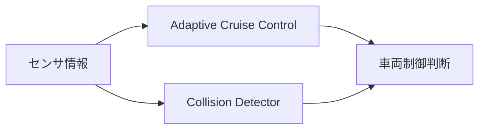
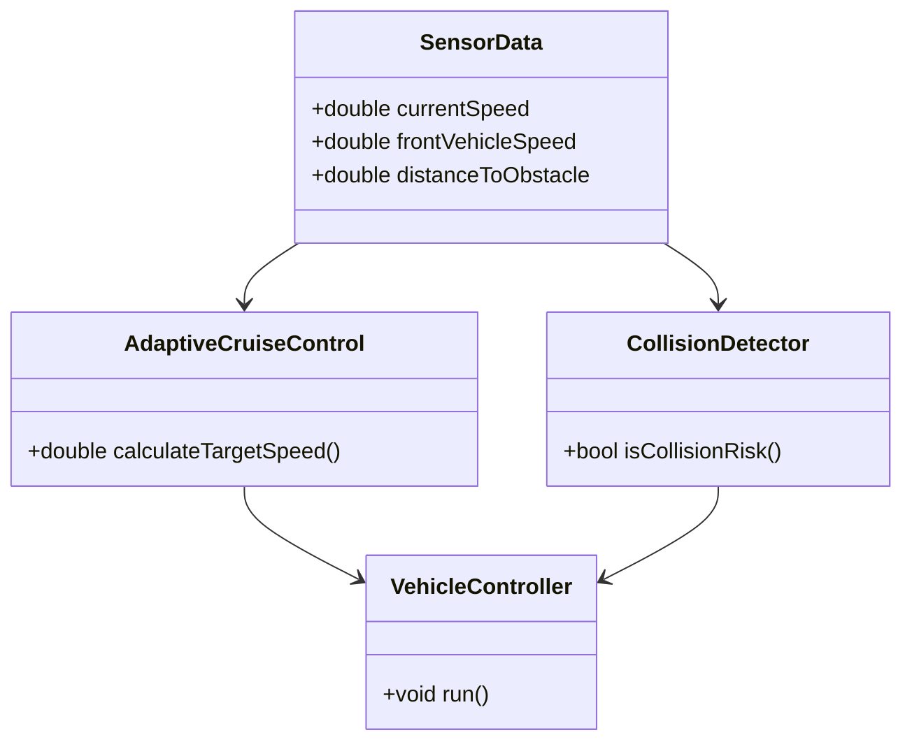
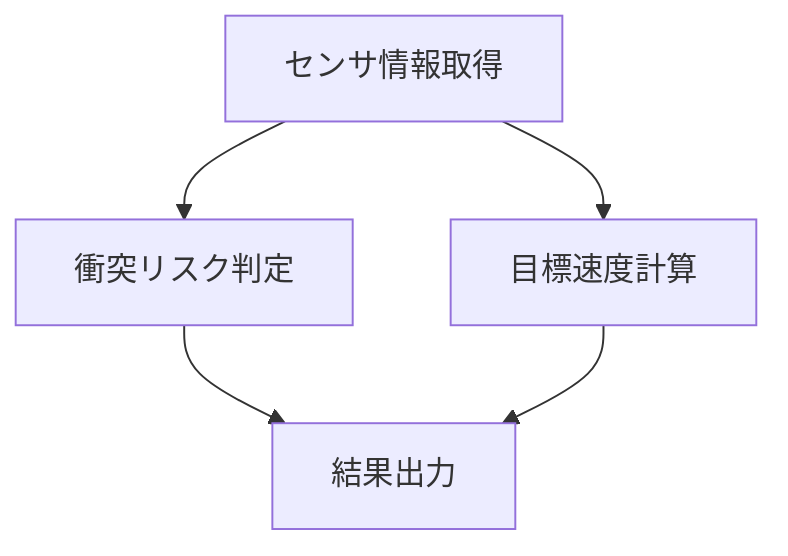

# Autonomous Driving Demo

C++17で実装した、自動運転システム向けの簡易シミュレータです。

前走車との車間距離や速度差をもとに、

- Adaptive Cruise Control（ACC）
- Collision Detection（衝突リスク判定）

を行います。

また、GoogleTestによる単体テストを実装し、ロジックの動作確認を行っています。

---

## 概要

本プロジェクトでは、自動運転システムにおける基本的な判断ロジックをシンプルに再現しています。

センサ情報を入力とし、

- 目標速度の計算
- 衝突リスクの判定

を行います。

---

## システム構成



---

## クラス構成



---

## 処理フロー



---

## 実装機能

### Adaptive Cruise Control

以下の情報をもとに目標速度を計算します。

- 自車速度
- 前方車両速度
- 車間距離

---

### Collision Detection

以下の情報をもとに衝突リスクを判定します。

- 障害物までの距離
- 相対速度

---

### 単体テスト

GoogleTestを利用して衝突判定ロジックを検証しています。

実施しているテストケース

- 衝突リスクあり
- 衝突リスクなし
- 前方車両の方が速い場合

---

## ディレクトリ構成

```text
autonomous-driving-demo
├── CMakeLists.txt
├── README.md
│
├── docs
│   └── design.md
│
├── include
│   ├── AdaptiveCruiseControl.hpp
│   ├── CollisionDetector.hpp
│   └── SensorData.hpp
│
├── src
│   ├── AdaptiveCruiseControl.cpp
│   ├── CollisionDetector.cpp
│   └── main.cpp
│
└── tests
    └── CollisionDetectorTest.cpp
```

---

## ビルド方法

```bash
mkdir build

cd build

cmake ..

make
```

---

## 実行方法

```bash
./autonomous_demo
```

---

## 実行例

```text
Target Speed : 50 km/h
Collision Risk : true
```

---

## テスト実行

```bash
./collision_detector_test
```

または

```bash
ctest --verbose
```

実行結果

```text
[==========] Running 3 tests
[  PASSED  ] 3 tests
```

---

## 使用技術

- C++17
- CMake
- GoogleTest
- オブジェクト指向設計
- 単体テスト

---

## 今後の拡張案

- Lane Keeping Assist（LKA）
- TTC（Time To Collision）によるリスク評価
- 複数障害物対応
- 経路計画（Path Planning）
- センサフュージョン
- AUTOSARを意識したインターフェース分離

---

## 作成目的

自動運転ソフトウェア開発で用いられる考え方を学習するために作成しました。

特に、

- C++による設計
- CMakeによるビルド環境構築
- GoogleTestによる単体テスト
- 自動運転アルゴリズムの基礎実装

を経験することを目的としています。