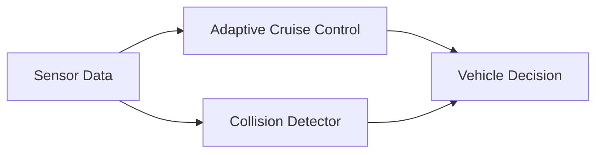
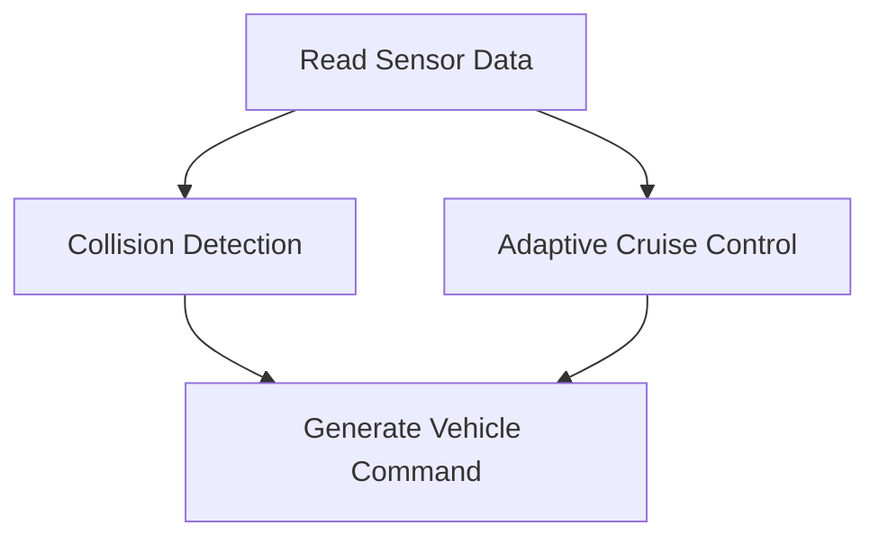

# Autonomous Driving Demo

A lightweight autonomous driving simulation written in modern C++17.

This project demonstrates the implementation of core autonomous driving concepts, including:

- Adaptive Cruise Control (ACC)
- Collision Risk Detection
- Unit Testing with GoogleTest
- Modular C++ Software Design
- CMake-based Build System

---

## Overview

The application simulates a simplified vehicle control pipeline.

Sensor information is provided to both the Adaptive Cruise Control module and the Collision Detection module to determine the vehicle's target behavior.

---

## Architecture



---

## Component Diagram

```mermaid
classDiagram

class SensorData
{
    +currentSpeed
    +frontVehicleSpeed
    +distanceToObstacle
}

class AdaptiveCruiseControl
{
    +calculateTargetSpeed()
}

class CollisionDetector
{
    +isCollisionRisk()
}

SensorData --> AdaptiveCruiseControl
SensorData --> CollisionDetector
```

---

## Execution Flow



---

## Features

### Adaptive Cruise Control

Calculates a safe target speed based on:

- Current vehicle speed
- Front vehicle speed
- Following distance

### Collision Detection

Evaluates collision risk using:

- Relative speed
- Distance to obstacle
- Time-to-Collision (TTC) concept

### Unit Testing

The collision detection logic is validated using GoogleTest.

Covered scenarios include:

- Collision Risk
- No Collision Risk
- Front Vehicle Faster

---

## Project Structure

```text
autonomous-driving-demo
├── CMakeLists.txt
├── README.md
│
├── docs
│   └── design.md
│
├── include
│   ├── AdaptiveCruiseControl.hpp
│   ├── CollisionDetector.hpp
│   └── SensorData.hpp
│
├── src
│   ├── AdaptiveCruiseControl.cpp
│   ├── CollisionDetector.cpp
│   └── main.cpp
│
└── tests
    └── CollisionDetectorTest.cpp
```

---

## Build

```bash
mkdir build

cd build

cmake ..

make
```

---

## Run

```bash
./autonomous_demo
```

---

## Example Output

```text
Target Speed : 50 km/h
Collision Risk : true
```

---

## Execute Tests

```bash
./collision_detector_test
```

or

```bash
ctest --verbose
```

Expected Output:

```text
[==========] Running 3 tests
[  PASSED  ] 3 tests
```

---

## Technologies

- C++17
- CMake
- GoogleTest
- Object-Oriented Design
- Unit Testing

---

## Future Enhancements

- Lane Keeping Assist (LKA)
- Object Tracking
- Path Planning
- Sensor Fusion
- Extended TTC-based Risk Assessment
- Integration with AUTOSAR-style Interfaces

---

## Motivation

This project was created to practice software design techniques commonly used in autonomous driving systems.

The goal is to build a clean and testable architecture while demonstrating the implementation of core driver assistance functions using modern C++.